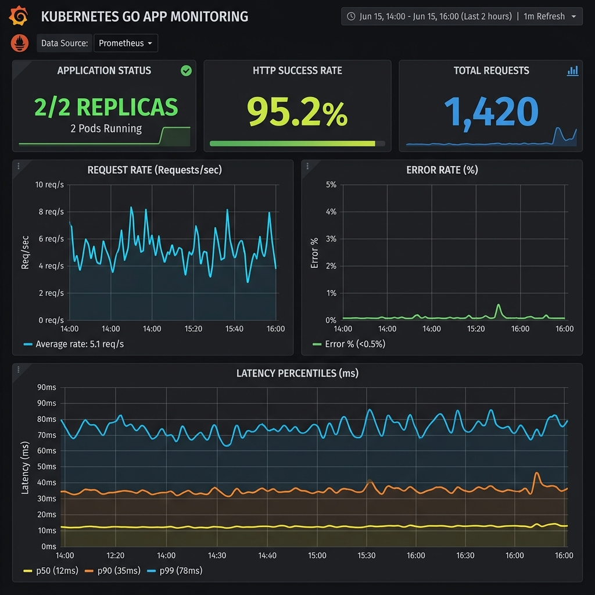

# 🚀 GitOps & Observability Kubernetes Platform

A production-grade, local Kubernetes platform built using a multi-node **KIND** (Kubernetes in Docker) cluster. This repository implements a fully automated, secure software delivery lifecycle (SDLC) and observability pipeline, adhering to modern Cloud Native and GitOps best practices.

It showcases how to take a custom containerized application from source code to production deployment, featuring automated testing, CVE vulnerability gating, GitOps continuous delivery with self-healing, and dynamic RED metrics/log aggregation.

## 📊 Live Grafana Telemetry Dashboard


---

## 📐 Architecture & Traffic Flow

The diagram below illustrates the end-to-end flow of code (CI/CD), external user traffic (Ingress), metrics collection (Prometheus), and log shipping (Loki):

```mermaid
graph TD
    %% CLI/Git Ops
    subgraph Developer Workflow
        Dev[Developer] -->|Git Push| GitHub[GitHub Repo]
        GitHub -->|Triggers CI| GHA[GitHub Actions]
        GHA -->|1. Lint & Validate| GHA
        GHA -->|2. Docker Build & Scan| GHA
        GHA -->|3. Push Image| GHCR[GitHub Container Registry]
        GHA -->|4. Update Image Tag| GitHub
    end

    %% GitOps Loop
    subgraph GitOps (ArgoCD)
        Argo[ArgoCD Controller] -->|Polls Repo & Syncs State| GitHub
        Argo -->|Deploys/Updates| K8s[KIND Cluster]
    end

    %% Ingress & App
    subgraph Kubernetes Runtime
        HostTraffic[curl localhost:80] -->|Port Map| NginxIng[NGINX Ingress Controller]
        NginxIng -->|Routes Traffic| AppSvc[ClusterIP Service]
        AppSvc -->|Load Balances| Pod1[Go App Pod A]
        AppSvc -->|Load Balances| Pod2[Go App Pod B]
    end

    %% Observability
    subgraph Observability Stack
        Prom[Prometheus Server] -->|Scrapes /metrics via ServiceMonitor| Pod1
        Prom -->|Scrapes /metrics via ServiceMonitor| Pod2
        Promtail[Promtail DaemonSet] -->|Tail Pod Logs| Pod1
        Promtail -->|Tail Pod Logs| Pod2
        Promtail -->|Ships Logs| Loki[Loki Single Binary]
        
        Grafana[Grafana Dashboard] -->|Queries Metrics| Prom
        Grafana -->|Queries Logs| Loki
    end
```

---

## 🛠️ Technology Stack

| Category | Component | Purpose |
|---|---|---|
| **Cluster Orchestration** | [KIND (Kubernetes in Docker)](https://kind.sigs.k8s.io/) | Lightweight local multi-node Kubernetes environment |
| **Ingress Control** | [NGINX Ingress Controller](https://kubernetes.github.io/ingress-nginx/) | Host/path-based reverse proxy routing traffic from `localhost` |
| **Application Runtime** | [Go (1.22)](https://go.dev/) | Custom microservice exposing Prometheus metrics and HTTP check probes |
| **Container Engine** | [Docker](https://www.docker.com/) | Multi-stage scratch build, running as a non-privileged user (6.45 MB image) |
| **Package Management** | [Helm (v3)](https://helm.sh/) | Standardized templates packaging deployments, services, ingress, and HPA |
| **Continuous Integration** | [GitHub Actions](https://github.com/features/actions) | Auto-validates manifests, runs Trivy vulnerability scanner, and pushes to GHCR |
| **Continuous Delivery** | [ArgoCD](https://argoproj.github.io/cd/) | GitOps controller synchronizing cluster configuration with Git source of truth |
| **Metrics Collection** | [Prometheus](https://prometheus.io/) | Pulls metrics from targets using custom declared `ServiceMonitor` CRDs |
| **Visualization** | [Grafana](https://grafana.com/) | Live dashboard displaying RED application health metrics |
| **Log Management** | [Loki + Promtail](https://grafana.com/oss/loki/) | Low-overhead log aggregation and log streaming |

---

## 🚀 Phase-by-Phase Roadmap

### **Phase 1: Local Cluster & Ingress Setup**
- Provisioned a 3-node KIND cluster (1 control-plane and 2 worker nodes) configured with native HTTP/HTTPS port mappings.
- Installed the NGINX Ingress Controller pinned to the control-plane node using tolerations and `ingress-ready` labels.

### **Phase 2: App Instrumentation & Helm Charting**
- Developed a Go HTTP service exposing standard `/health` endpoints and a `/metrics` route instrumented with Prometheus RED metric collectors (`http_requests_total`, `http_request_duration_seconds`).
- Built an optimized multi-stage `Dockerfile` creating a tiny static Alpine environment executing as an unprivileged user (UID `10001`).
- Created a fully parameterizable Helm chart specifying compute resources (limits/requests), auto-scaling rules (HPA), and a dynamic `ServiceMonitor` resource.

### **Phase 3: CI/CD Pipeline Automation**
- Wrote a GitHub Actions pipeline executing `kubeconform` to validate Kubernetes schemas, linting the Helm chart, compiling the Go binary, scanning for critical CVEs via `Trivy`, publishing images to GHCR, and modifying the tag back in `values.yaml` in a loop-safe manner.

### **Phase 4: ArgoCD GitOps Integration**
- Deployed ArgoCD inside the `argocd` namespace and bootstrapped a declarative GitOps Application mapping local workloads to Git.
- Configured automated pruning and self-healing. (Verified by manual scaling scale-down/scale-up drift correction).

### **Phase 5: Observability Stack Deployment**
- Deployed a memory-optimized `kube-prometheus-stack` alongside Loki and Promtail.
- Configured declarative sidecar imports to auto-import a customized **RED Metrics Dashboard** and **Loki Data Source** into Grafana.

---

## 🔧 Run & Verify Locally

### 1. Prerequisites
Ensure you have the following CLI utilities installed:
* Docker
* KIND
* Helm
* Kubectl

### 2. Bootstrapping the Platform
Run the entrypoint script to build the KIND cluster and initialize the ingress:
```bash
./scripts/bootstrap-cluster.sh
./scripts/install-stack.sh
```

### 3. Running Port Forwards
Run the background forwarder to make all admin dashboards accessible:
```bash
./scripts/port-forward-all.sh
```
* **ArgoCD Dashboard**: `https://localhost:8080` (Username: `admin` / Password: run `kubectl -n argocd get secret argocd-initial-admin-secret -o jsonpath="{.data.password}" | base64 -d`)
* **Grafana Dashboards**: `http://localhost:3000` (Credentials: `admin` / `admin`)
* **Prometheus API**: `http://localhost:9090`

### 4. Running a Traffic Load Test
To see live metrics populate in Grafana, start the automated load test in another terminal window:
```bash
./scripts/load-test.sh
```

---

## 💡 Key Architectural Design Decisions

* **Why unprivileged multi-stage containers?** The application runs under user UID `10001` with standard system capabilities dropped (`readOnlyRootFilesystem: true`, `runAsNonRoot: true`). This prevents attackers from executing privilege escalation attacks even if a shell vulnerability is found.
* **Why ServiceMonitor instead of static scraping?** Prometheus Operator scans for `ServiceMonitor` objects dynamically. This decouples service definitions from monitoring configurations, allowing developers to define monitoring rules inside their Helm charts rather than editing the main Prometheus config.
* **Why dashboard sidecars?** Rather than setting up dashboards manually inside the Grafana UI, we use the `grafana-sc-dashboard` sidecar. This watches ConfigMaps labeled with `grafana_dashboard: "1"`, ensuring Grafana remains stateless and configurations are version-controlled in Git.
